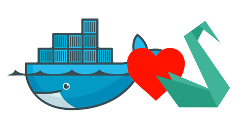

<p align="center">
    
</p>


## Docker environment for [Sylius](https://sylius.com/) Project</h1>

For more information on how Sylius works, please read all the [documentation](http://docs.sylius.com)

## Installation

1. Clone docker4sylius repository

    ```bash
    $ git clone git@github.com:nietzscheson/docker4sylius.git
    ```

2. Clone Sylius-Standard repository

    ```bash
    $ git clone git@github.com:Sylius/Sylius-Standard.git sylius
    ```

3. Run Docker's containers

   ```bash
   $ docker-compose up --build -d
   ```

4. Install Sylius vendors

    ```bash
    $ docker-compose run --rm php composer install
    ```

5. Install Sylius

    ```bash
    $ docker-compose run --rm php bin/console sylius:install
    ```

6. Install and build assets vendors

    ```bash
    $ docker-compose run --rm node yarn install
    ```
    ```bash
    $ docker-compose run --rm node yarn build
    ```

That's all. Try and fun!!!

This results in the following running containers:

```bash
$ docker-compose ps
         Name                        Command              State                      Ports
-------------------------------------------------------------------------------------------------------------
docker4sylius_db_1        docker-entrypoint.sh mysqld     Up       3306/tcp
docker4sylius_nginx_1     nginx -g daemon off;            Up       80/tcp
docker4sylius_node_1      node                            Exit 0
docker4sylius_php_1       docker-php-entrypoint php-fpm   Up       9000/tcp
docker4sylius_se_1        /opt/bin/entry_point.sh         Up       0.0.0.0:4444->4444/tcp
docker4sylius_traefik_1   /traefik --api --docker         Up       0.0.0.0:80->80/tcp, 0.0.0.0:8080->8080/tcp
phpmyadmin                /run.sh supervisord -n          Up       0.0.0.0:81->80/tcp, 9000/tcp
-----------
```

## Testing

Inside the standard Sylius modify the behat.yml.dist adding the following:

```yml
default:
    extensions:
        Behat\MinkExtension:
            base_url: "http://nginx/app_test.php"
            sessions:
                selenium2:
                    selenium2:
                        wd_host: http://selenium:4444/wd/hub
```
And run Behat:

```bash
    $ docker-compose run --rm php bin/behat
```
## License

This bundle is published under the [MIT License](LICENSE)

## Contributing

First of all, **thank you** for contributing ♥  
If you find any typo/misconfiguration/... please send me a PR or open an issue. You can also ping me on [twitter](https://twitter.com/nietzscheson).  
Also, while creating your Pull Request on GitHub, please write a description which gives the context and/or explains why you are creating it.
